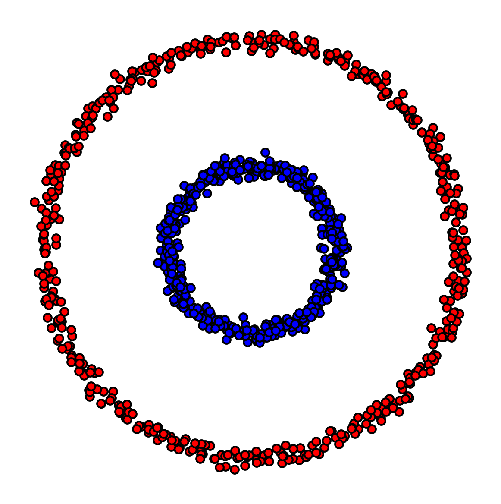

# Neural Networks in Leo

This repository provides a framework for creating aleo programs for inference on multi-layer feedforward networks.

As an example, we deploy an aleo program comprising a neural network with one hidden layer and one output layer and demonstrate it for the problem of binary classification on circles dataset.

## Quickstart

Please make sure you have leo installed. If not, follow the instructions [here](https://developer.aleo.org/leo/installation).

To run the binary classsification neural network example, follow these steps:

```sh
# Clone the repository
git clone https://github.com/metavind/leo-ml.git
cd leo-ml

# Run the leo program
leo run compute

# Run the leo program on a custom input
leo run compute "{ in1: 966399i128, in2: 359227i128 }"

# Run the test script
./test_nn.sh
```

Please ensure a `.env` file is present in the root directory of the repository. The file should contain the following environment variables:

```sh
NETWORK=testnet3
PRIVATE_KEY=<your_private_key>
```

## Generating Aleo program from a custom trained neural network

Run the following command to generate an Aleo program for inference using the parameters of a custom trained neural network:

```sh
python leo_program_generator.py --program_name <desired_program_name> --model_parameters <path_to_model_parameters>
```

The above command will generate the Aleo program in `src/main.leo`, create an appropriate `program.json` file, and also create an input template file for the program in `inputs/<desired_program_name>.in`.

In the input file, fill the custom input data that you would like the model to run on. The model can then be run using the following command:

```sh
leo run compute
```

Alternatively, you can use the following command directly to run the model on a specific input:

```sh
leo run compute "{ in1: <input_1>, in2: <input_2>, ... , inn: <input_n> } }"
```

Here, *in1*, *in2*, ..., *inn* are the input variables of the model which takes an input of dimension *n*. They must be appropriately suffixed with *i128*.

Note: The model_parameters file should be a JSON containing the neural network's weights and biases. The JSON should have keys of the form *l\{idx}_weights* and *l\{idx}_biases*, where *idx* is the layer number (starting from 1). The value of each key should be a flattened list of the weights/biases of the corresponding layer. For example, the following JSON is a valid model_parameters file for a neural network with 2 hidden layers and 1 output layer. It has an input dimension of 3, and an output dimension of 1.

```json
{
    "l1_weights": [1, 2, 3, 4, 5, 6],
    "l1_biases": [1, 2],
    "l2_weights": [1, 2, 3, 4],
    "l2_biases": [1, 2],
    "l3_weights": [1, 2],
    "l3_biases": [1]
}
```

## Testing the generated Aleo program on custom test samples

Run the following command to generate a test script for the generated Aleo program on custom test samples:

```sh
python leo_program_generator.py --program_name <program_name> --test_samples <path_to_test_samples>
```

The above command will generate a test script `<program_name>.sh` which can be run using the following command:

```sh
./test_<program_name>.sh
```

The test script will run the generated Aleo program on each test sample and print the output of the Aleo program, along with the expected output from the neural network.

Note: The test_samples file should be a JSON containing the test samples. The JSON should have keys of the form *input{idx}* and *output{idx}*, where *idx* is the index of the test sample (starting from 1). The value of each key should be a list of the input/output of the corresponding test sample. For example, the following JSON is a valid test_samples file for a neural network defined by the parameters in the above example.

```json
{
    "input1": [1, 2, 3],
    "output1": 0,
    "input2": [4, 5, 6],
    "output2": 1
}
```

## Example - Binary classification on circles dataset

We demonstrate the use of the framework by creating an Aleo program for simple neural network inference applied to the problem of binary classification on circles dataset.

### Circles dataset

The circles dataset is a toy dataset which consists of concentric circles of 2 classes of points. The dataset is shown below:



Circles dataset - the blue points have class label 1, and the red points have class label 0
&nbsp;

### Neural network training

We train a neural network with one hidden layer of dimension 10 and one output layer on this dataset. The neural network training code is present in the jupyter notebook [`training/circle_fc.ipynb`](training/circle_fc.ipynb). Once the model is trained, we save the model parameters in [`training/circle_fc_parameters.json`](training/circle_fc_parameters.json) and also save some test samples in [`training/circle_fc_samples.json`](training/circle_fc_samples.json).

### Generating Aleo program for inference

We generate an Aleo program for inference using the following command:

```sh
python leo_program_generator.py --program_name nn --model_parameters training/circle_fc_parameters.json

# Generated Aleo program code: src/main.leo
# Generated Aleo program input template: inputs/nn.in
# Generated Aleo program json: program.json
```

This creates the Aleo program in [`src/main.leo`](src/main.leo), creates a [`program.json`](program.json) file, and also creates an input template file for the program in [`inputs/nn.in`](inputs/nn.in).

We check that the program has been generated correctly by running the following command:

```sh
leo run compute "{ in1: 966399i128, in2: 359227i128 }"


#        Leo ✅ Compiled 'main.leo' into Aleo instructions
#
# ⛓  Constraints
#
#  •  'nn.aleo/compute' - 54,770 constraints (called 1 time)
#
# ➡️  Output
#
#  • 0u8
#
#        Leo ✅ Finished 'nn.aleo/compute'
```

### Testing the Aleo program on test samples

We generate a test script to test the Aleo program on the test samples using the following command:

```sh
python leo_test_generator.py --program_name nn --test_samples training/circle_fc_samples.json

# Generated test script: test_nn.sh
```

This creates a test script [`test_nn.sh`](test_nn.sh) which can be run using the following command:

```sh
./test_nn.sh

# Running tests for nn program
#
# Test 1
# Actual Value   : 1u8
# Expected Value : 1u8
#
# Test 2
# Actual Value   : 0u8
# Expected Value : 0u8
#
# Test 3
# Actual Value   : 1u8
# Expected Value : 1u8
#
# ...
```

We will see that the output of the Aleo program matches the expected output from the neural network for each test sample.

### Deploying the program on Aleo Testnet3

We deploy the program on Aleo Testnet3. Since the testnet penalizes programs with short names, we renamed our program name to `nn_fab66aa01347d3f11a1646894137`. The deployment was done using the following command:

```sh
snarkos developer deploy "nn_fab66aa01347d3f11a1646894137.aleo" --private-key "${PRIVATE_KEY}" --query "https://vm.aleo.org/api" --path "./build/" --broadcast "https://vm.aleo.org/api/testnet3/transaction/broadcast" --fee 1 --record "${RECORD}"
```

The program was deployed successfully and the transaction id is [at15va7aacjlaq68v455fyqpjj2zzlm9zv4wav34yq0cg70vfrpqqgqcv8suj](https://www.aleo.network/transactions/at15va7aacjlaq68v455fyqpjj2zzlm9zv4wav34yq0cg70vfrpqqgqcv8suj).

### Executing the program on Aleo Testnet3

We execute the deployed program on Aleo Testnet3 using the following command:

```sh
snarkos developer execute "nn_fab66aa01347d3f11a1646894137.aleo" "compute" "{ in1: 4443i128, in2: 966478i128 }" --private-key "${PRIVATE_KEY}" --query "https://vm.aleo.org/api" --broadcast "https://vm.aleo.org/api/testnet3/transaction/broadcast" --fee 1 --record "${RECORD}"
```

The program was executed successfully and the transaction id is [at1neja6fjaazrpfjv9wrxn2g6gkynk9g79hezyh8pdl4pppjexcuyskq9yxv](https://www.aleo.network/transactions/at1neja6fjaazrpfjv9wrxn2g6gkynk9g79hezyh8pdl4pppjexcuyskq9yxv). It gives the correct output of `0u8`.

### Demo

We have created a demo video which can be found here: [https://drive.google.com/file/d/13QBKLl1WMl6H2aCBHjeZBaewC13sxy2_/view?usp=sharing](https://drive.google.com/file/d/13QBKLl1WMl6H2aCBHjeZBaewC13sxy2_/view?usp=sharing).
